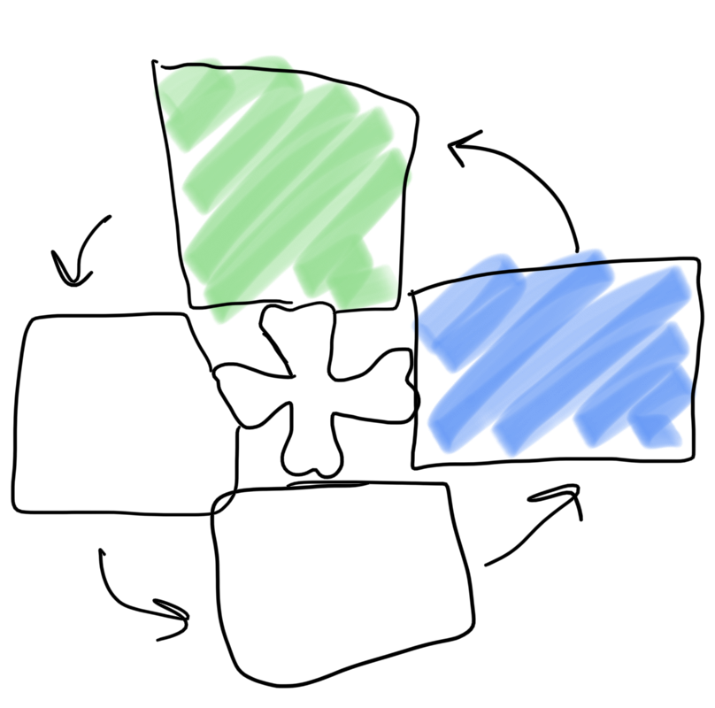
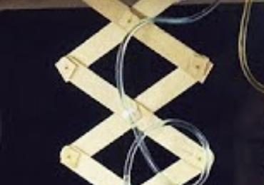
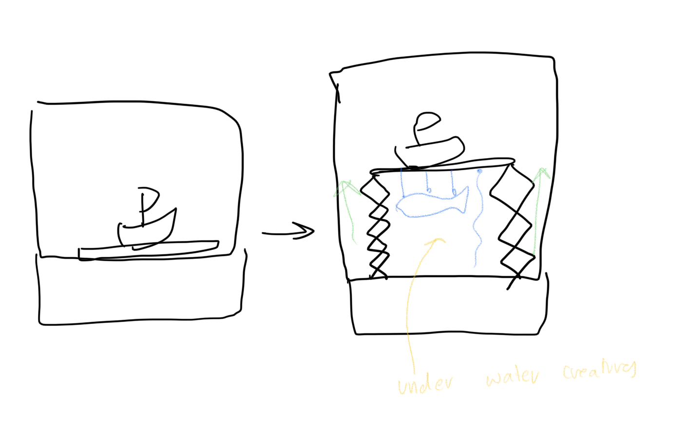
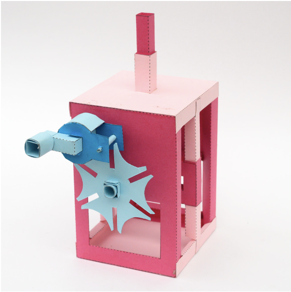
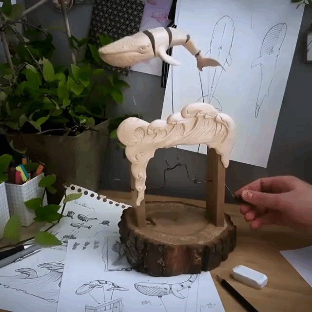
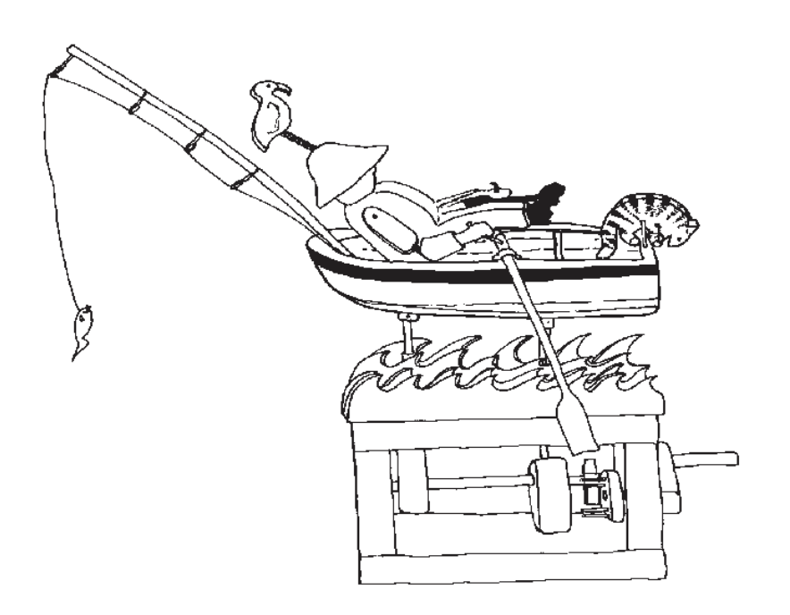
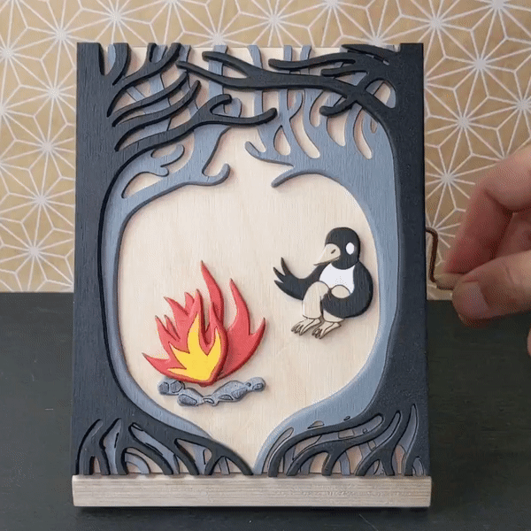
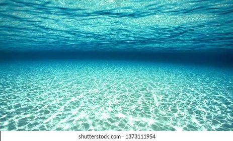
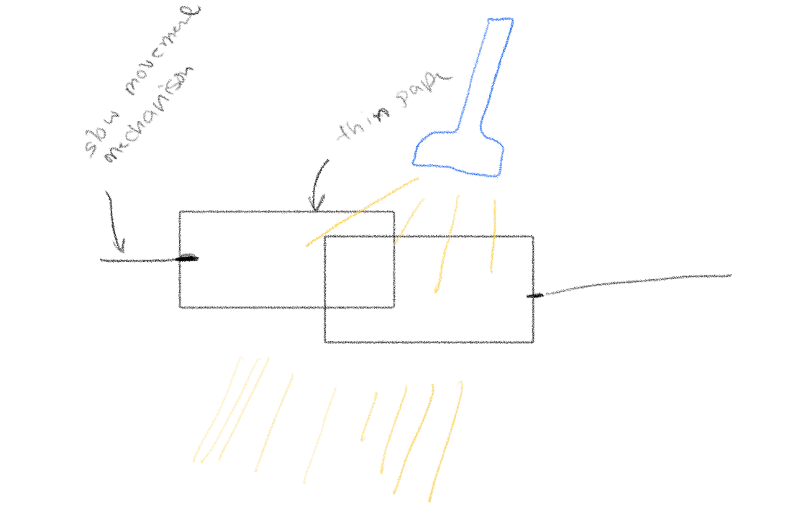

## goal: 
build machanism that would be part of clock

## idea
I was really inspired by [Ross McSweeney kinetic sculpture](https://parametrichouse.com/kinetic-wave-sculpture/) and all the movment that it had even though it was built from wood. I also find water and underwater creatures to be mesmerising. 
For this project I think I might create a story that takes place under water. a temporary idea is to tell the story of a shirmp who lives under water.

## mechanics and rough draft
### intermittent movement - scene background
I think it might be intresting to the geneva stop mechanism to control the background. Where everytime it turns a new backgroun appears

  

  

### upward movement
I also thought that maybe I could start the story above water, then the boat and its base move up (forgot what this thing is called)

  

but I would use it to raise the boat and the base. Under the base I would have attached some sea creatuers. My current plan is to add some sort of motion to the boat and base and attached the sea creatures that structure

  

### intermittent movement + upward movement
I found a [Geneva drive and Scotch Yoke mechanism](https://www.robives.com/blog/gsy/) that looked intrsting. It intermittently moves a rod up too which I think is an intresting movement. I could use that since it has both the geneva stop mechanism and a thing that could raise the boat.

  

### free movement 
I liked the movement of [this whale](https://www.youtube.com/watch?v=PgITt2pyESE), it looks so smooth and organic. so I think I might explore similar movements to use on the boat and sea creatures.

  

I also really want to explore free movement. The book(how To Design And Make Automata) showed this example of free movement of a sailor where many aspects such as the fish and cat are given the ability to move freely within a certain range

  

### 2d automata
while exploring the work of different creators I found a creator who makes 2d automata! I think it is an intresting concept to take all the different mechanisms and see what movemenet they could produce in a 2d enviroment. (some more work can be found here: https://wolfcatworkshop.com/index.php/portfolio/kinetic-works/)

  

  

### light movement
One last thing I want to explore is light shining through different materials to produce different effects. 

  

  

