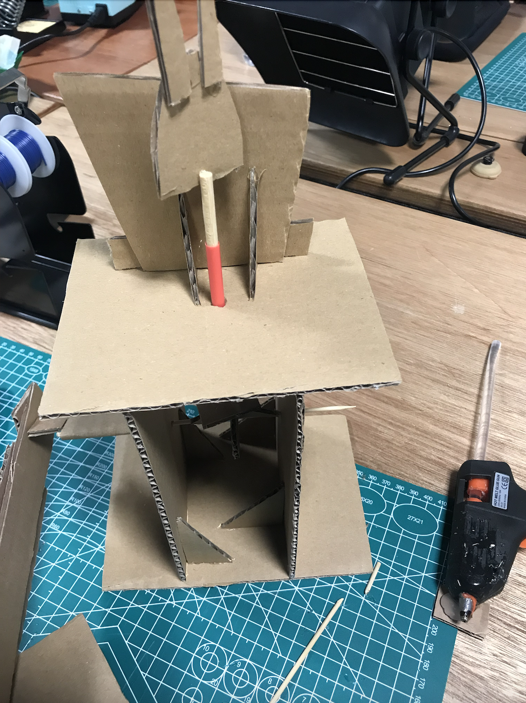
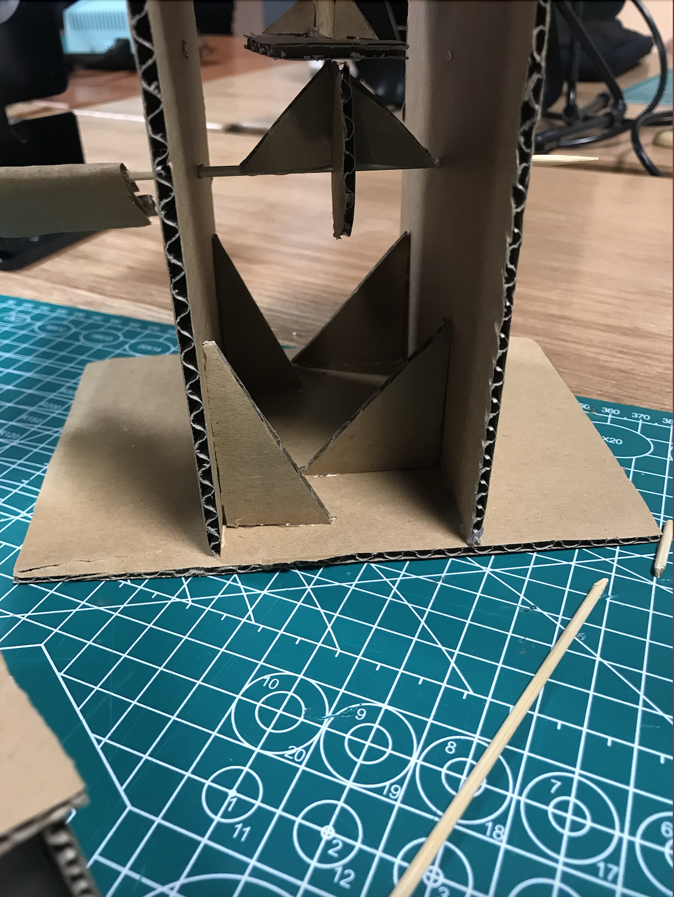
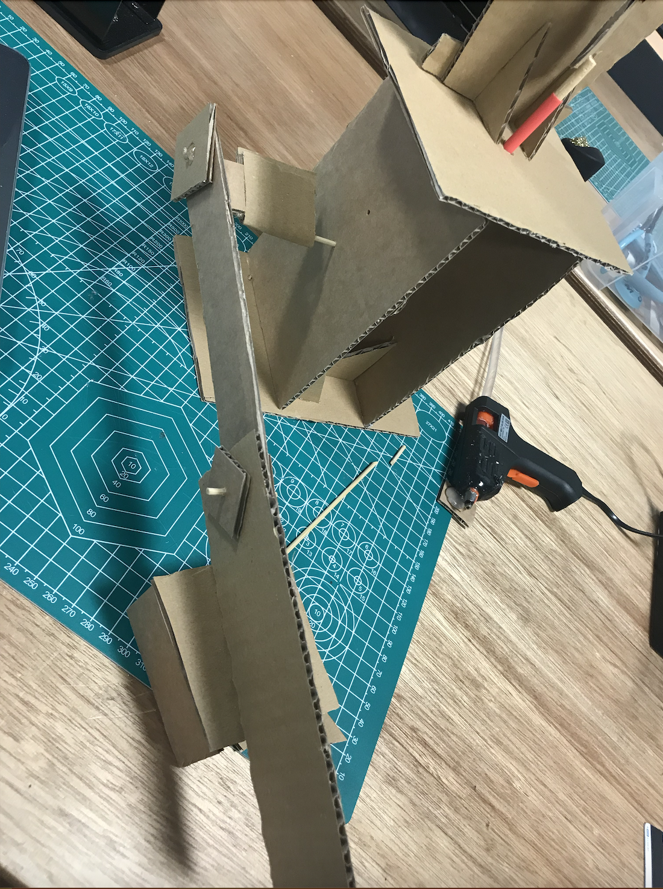
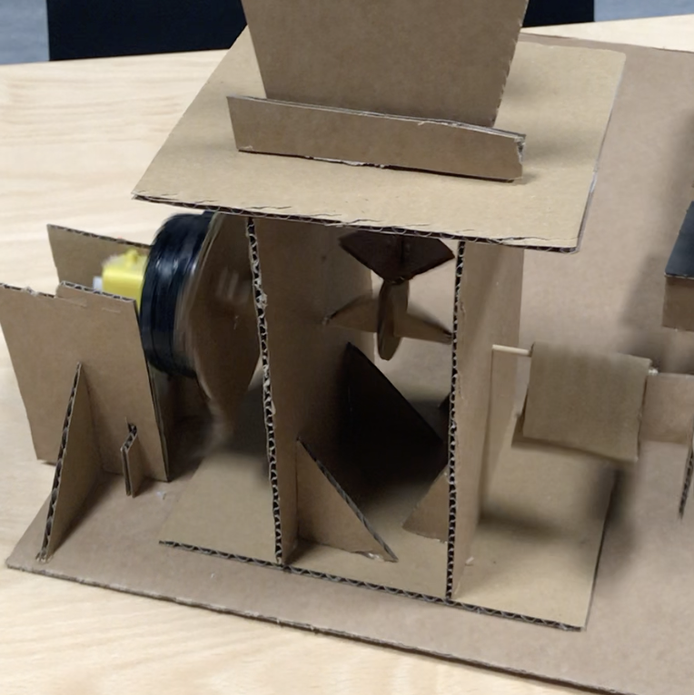
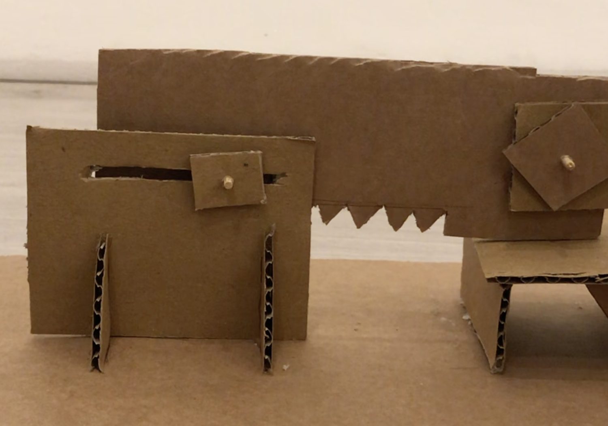
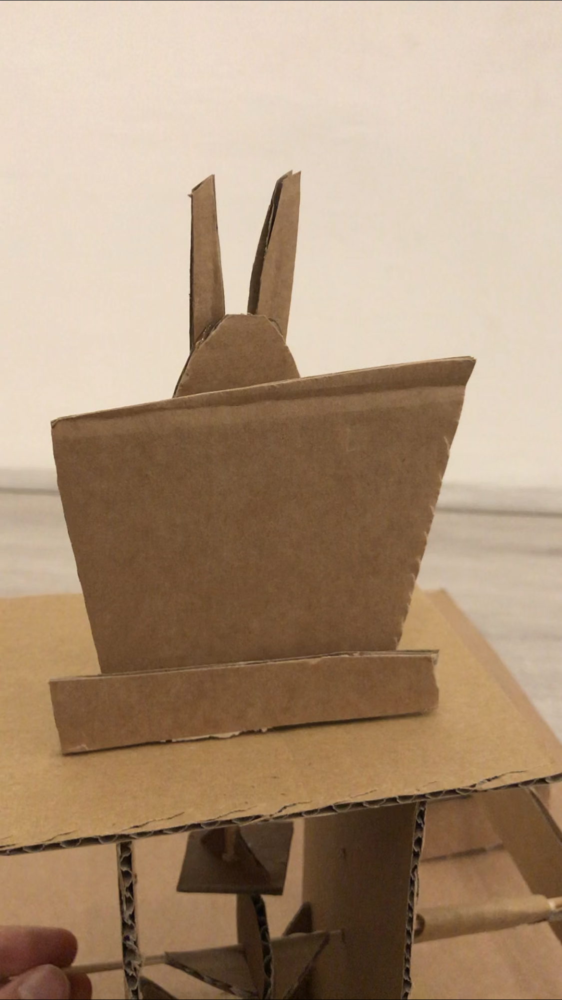
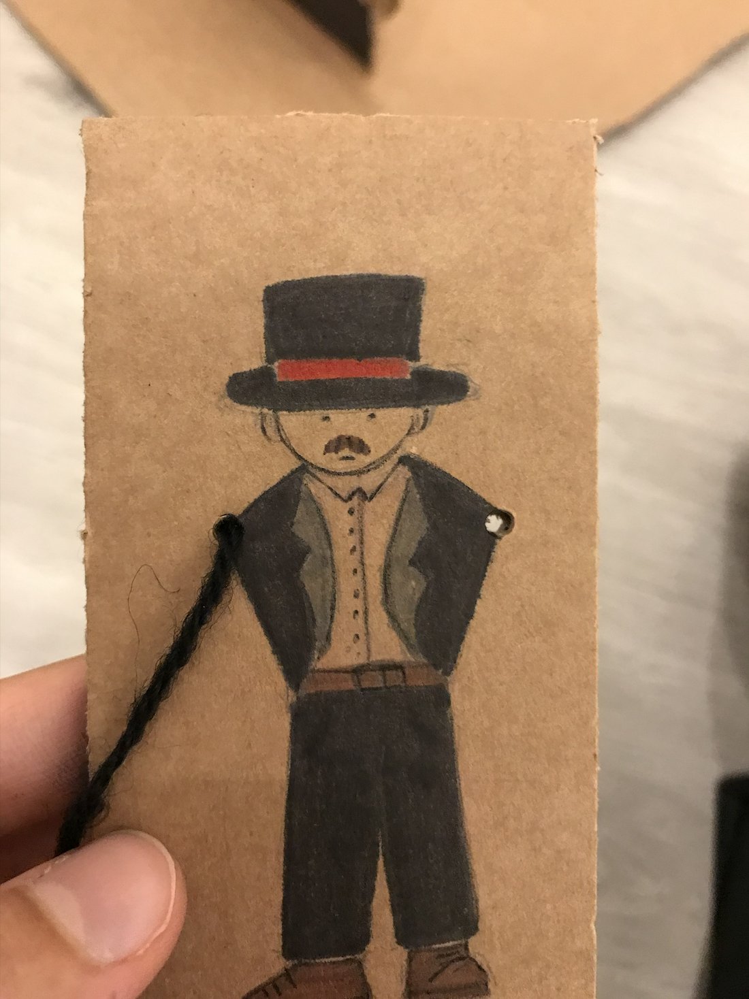
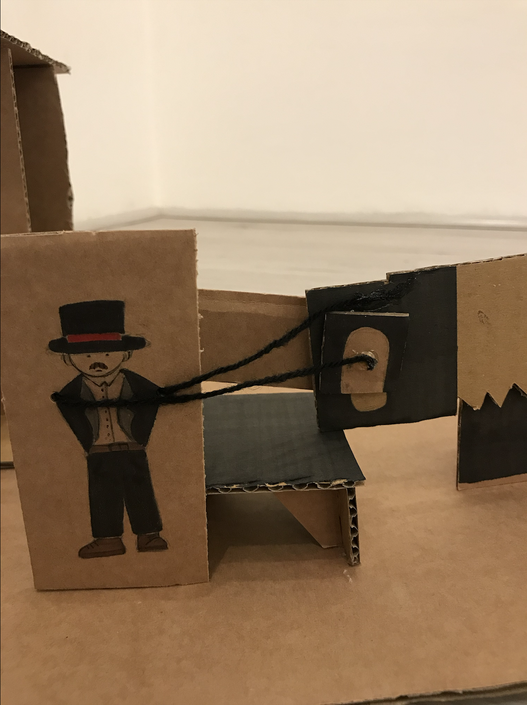

# Building a cardboard hand-crank mechanism
I really enjoyed this assignment and I feel like it gave me a better idea of how cranks and cams work and some issues that might pop up when building them.

There were a few issues/✨features✨ with the cam. Because the cam isn't perfectly aligned with the cam follower the rabbit on top was spinning(refer to video1.MP4). One short term solution is to attach two triangles behind the rabbit so that it wouldn't turn and only go up and down. but I kind of liked the way it spun so I kept it that way.

Another thing was that the cam shape caused the cam follower to not go up as much as I hoped. If I were to redo it I would test as many cam shapes as I could before I settle for the shape. I might experiment with more shapes as we continue in this course.

I also decided to create a narrow structure with I thought might add stability for the stick that holds the cam and prevent it from bending with the weight of the cam follower or motor. However, this resulted in me needing to plan where things would go and make sure I consider all the things that would need to go on the main cam stucture because I could run out of space before adding everything. 

  

  

  

Adding the bottle caps to prevent the rod from moving was a challenge because I couldn't comfertbly fit it on the rod but since there was very little extra space around the elements the rod was not moving a lot anyways so I decided to skip it, but I think that would propably increase the friction since it's carbaord making contact with cardboard so I'll make sure to create a wider stucuture to accomodate for all the needed elements.

  

I also wasn't sure if I wanted my slider to be held in place by a peice of carboad above it or some other way, and how strong it should be and how to make sure that it wouldn't interfer with the function of the slider. I decided to keep the slider by sticking a skewer into it and putting the skewer through a horezental slit in a peice of cardboard as shown below(there is probably a better way to explain this with proper terms)(refer to video2.mov) 

  

The up and down movement of the cam follower reminded me of rabbits coming out of magicians’ hats so I decided to add a rabbit to the cam follower and a magician that is "moving" saw beside the slider. (also I have been informed that the rabbits come out of the hat oppening and not the top of the hat, so the rabbit and hat thing here is inaccurate lol)(I also asked my sister to draw the magician)

  

  

  

