## idea
I wanted to explore Emarati/Arabic myths. 

### Background
There are a few creatures from myths from this region that me and my friends talked about in school when I was younger, but I didn't know their orgins or the acual way they were described when their stories used to be circulated. Some of the myths I found were used to deter children to from stuff that. For example one myth about a creature called "Hemarat elgayla" (roughly translates to The Donkey of Noon Time) was used to scare children from playing outside when around noon time because the sun was hottest at that time. Another example is "Bu Daryah" (roughly translates Man of the sea) which is a myth likely created to scare kids and youth from going to sea at night.

I picked a few of the ones that were associated with a time of day:

الحمارة القايلة noon

أم السعف والليف night

بابا درياه/بودرياه before sunrise

## design process
#### idea 1
I was not sure how to incoperate all 3 myths in my project so I sketched out a few ideas. One was to create 3 seperate 2d automata (inspired by wolfcatworkshop.com's automata) and then bringing each "scene" up after each other(like the image below labeled "idea 1 img"). but this would require me to handle all the wires connected to the motors and wasn't ideal in general.

  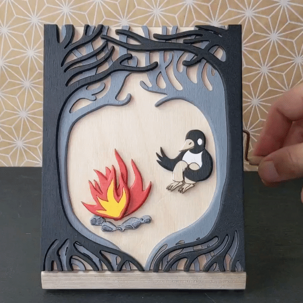

  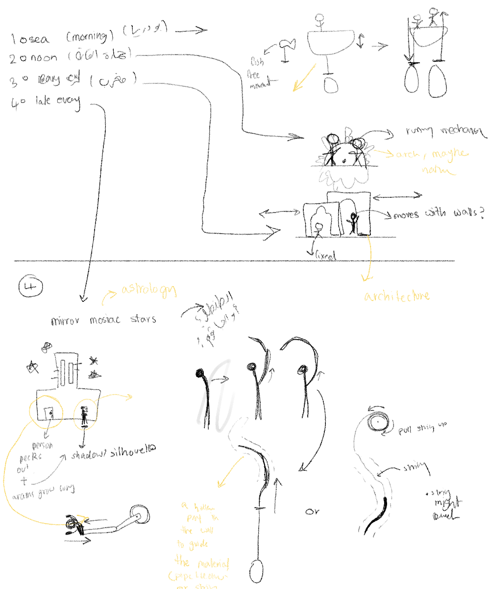

<figure ">
  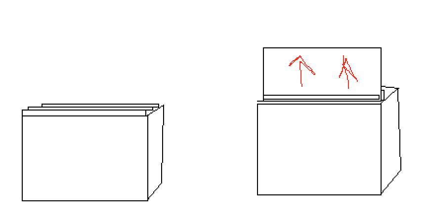
  <figcaption > idea 1 img </figcaption>
</figure>

#### idea 2
Another idea was to set all the myths in side a room in a traditional house. So the myth's creatures would peek into the window or through the door. Initially one of the myth was one that took place in the house but I decided not to inlcude that one, and all the other myths take place outside so it became pointless to set the myths inside a house.

  

  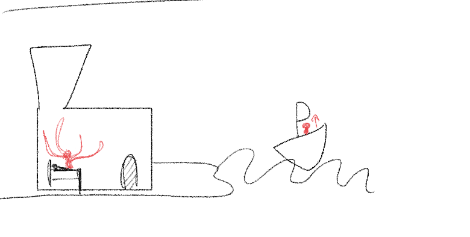

#### idea 3
One idea was to create 2D automata and place them on the walls of the box. or maybe as a comic strip. I didn't continue with those ideas though.

  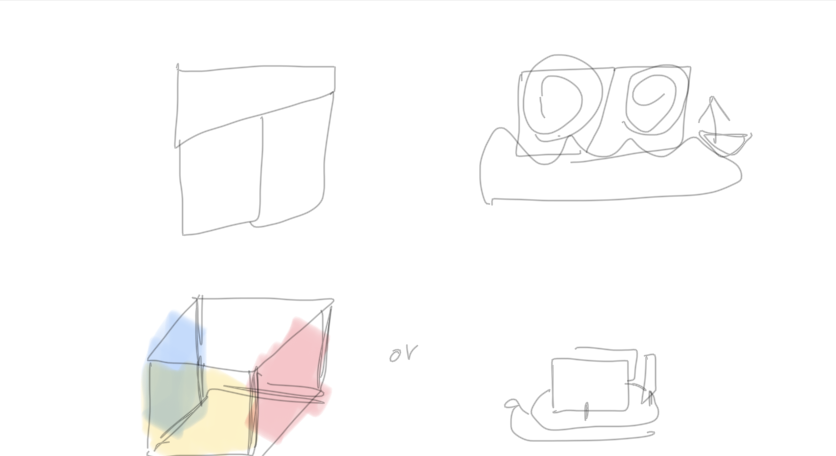

#### idea 4
I liked how the myths looked beside each other so I decided to find a way to place them beside each other in a cohesive way and setteled on this.

  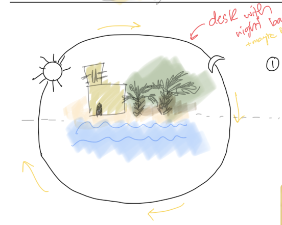

this is how I generally wanted it to look like and then I started working out the details.

  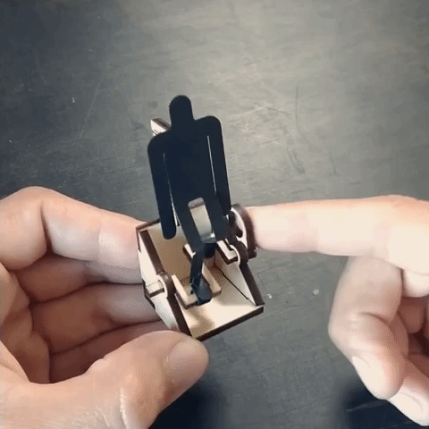

## aesthetic inspiration

  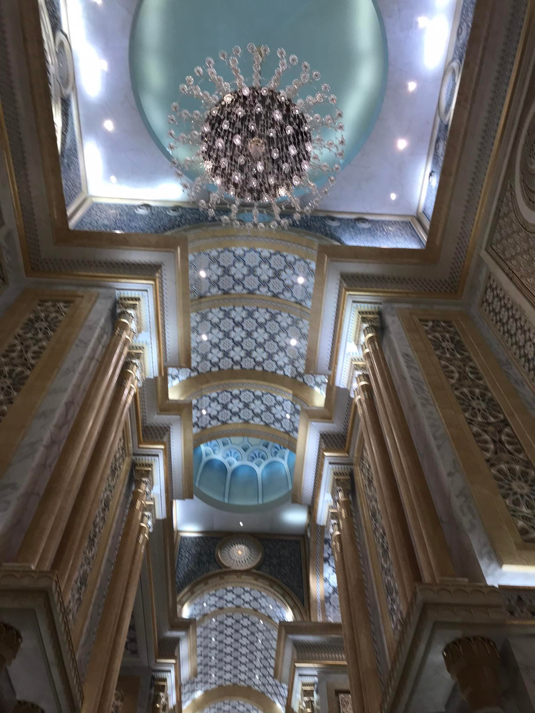

  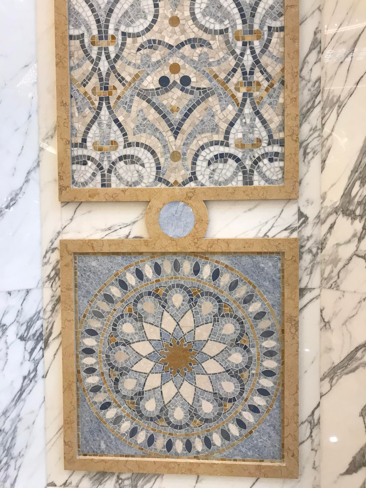

  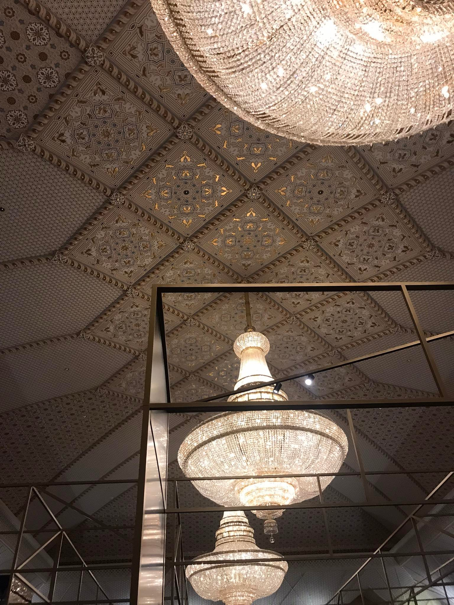

  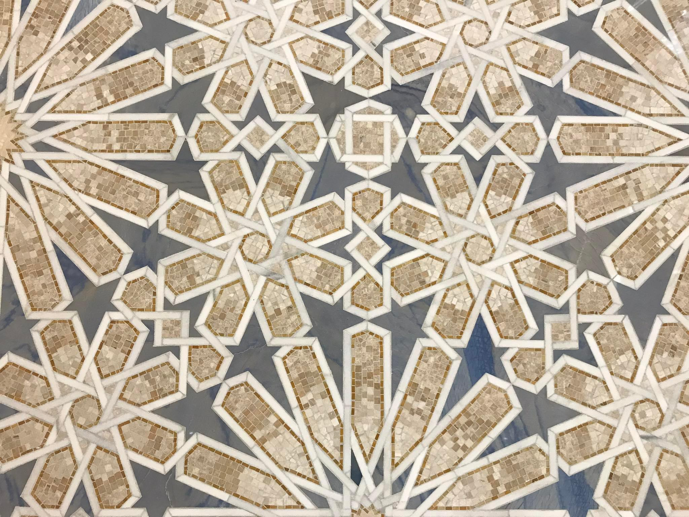

  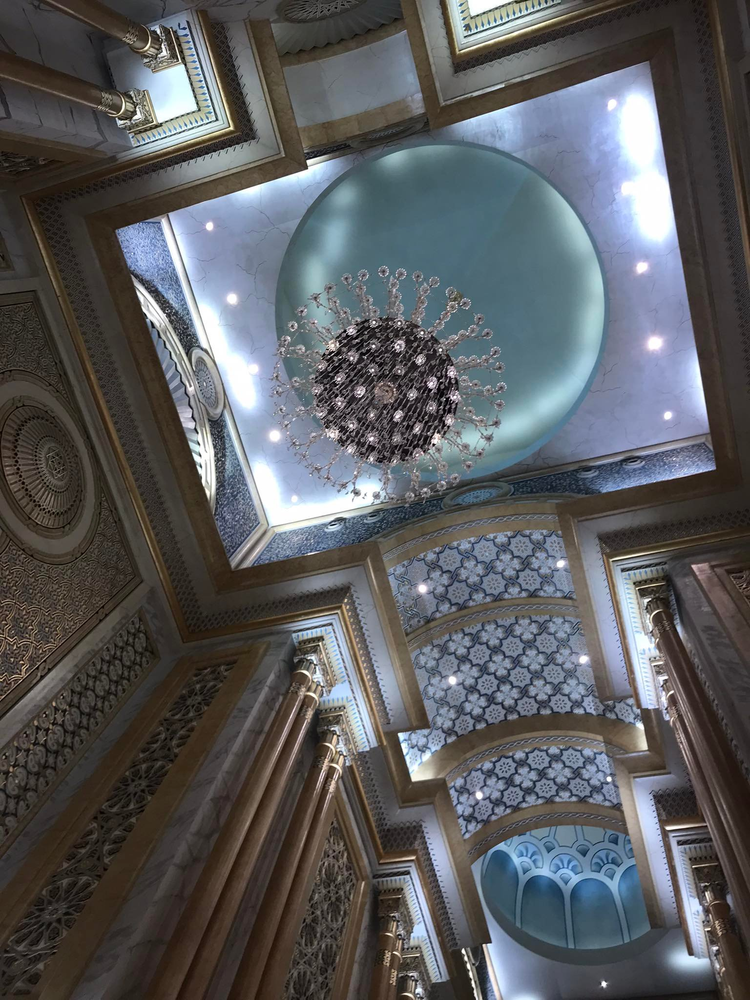

  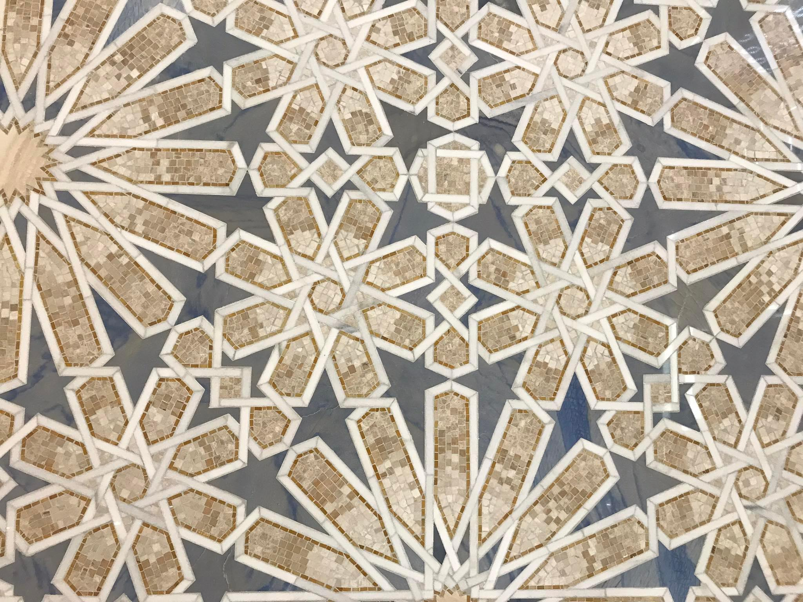

  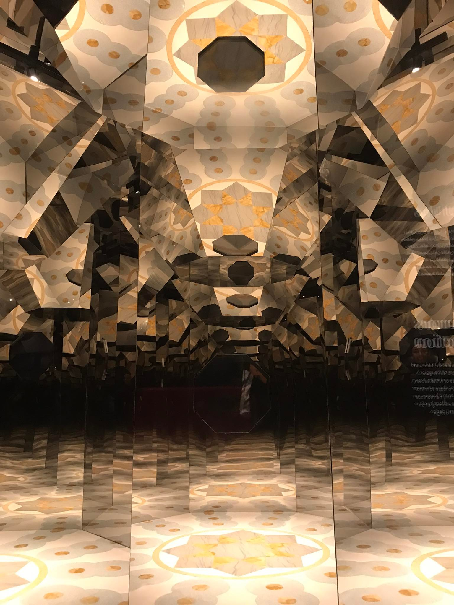

  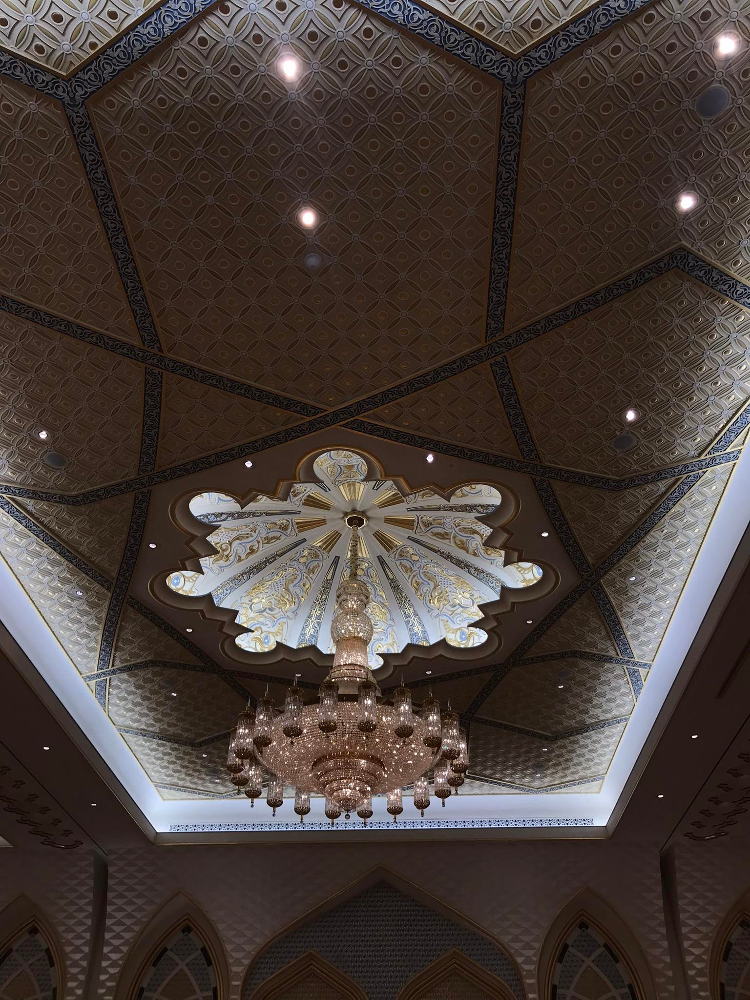

  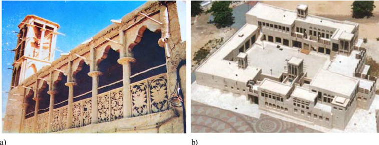

  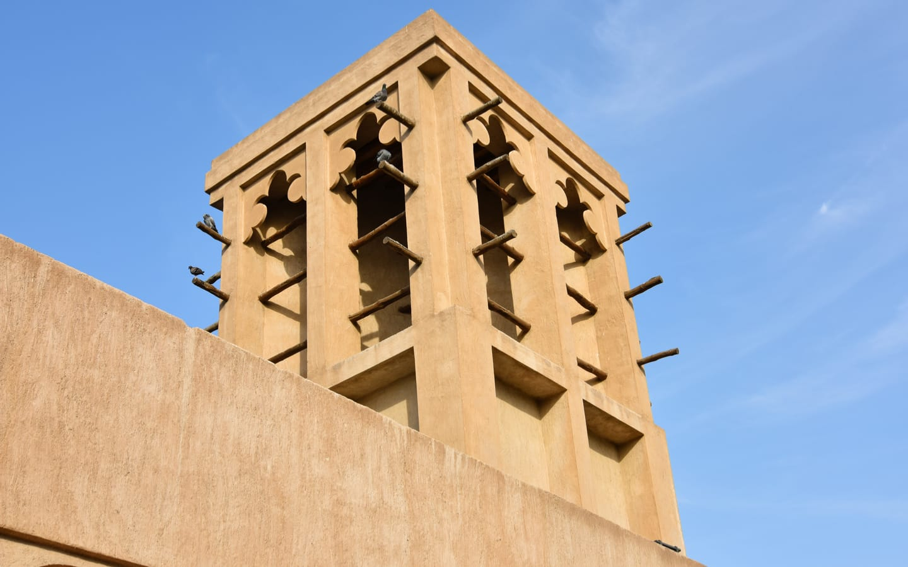

