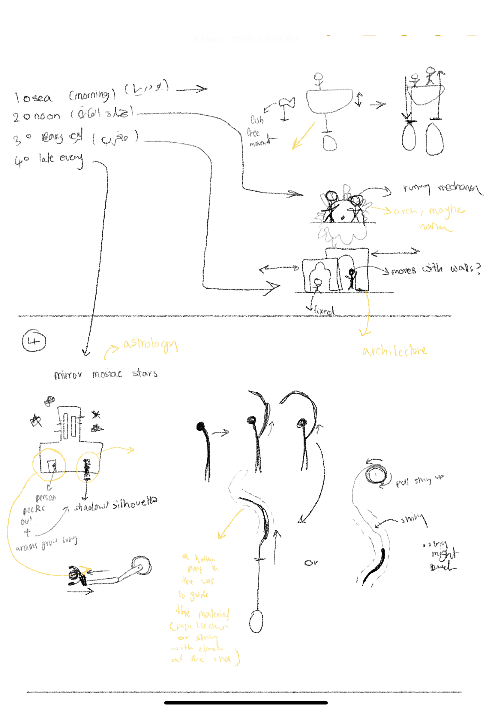
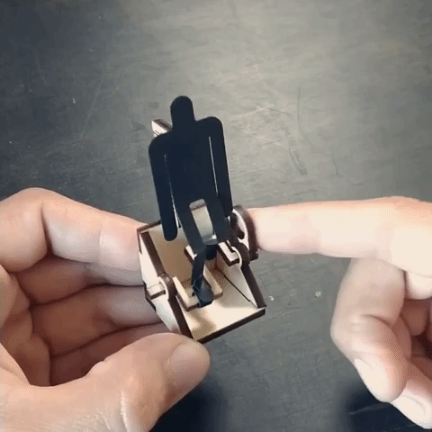

## idea
I wanted to explore Emarati/Arabic myths. 

### Background
There are a few creatures from myths from this region that me and my friends talked about in school when I was younger, but I didn't know their orgins or the acual way they were described when their stories used to be circulated. Some of the myths I found were used to deter children to from stuff that. For example one myth about a creature called "Hemarat elgayla" (roughly translates to The Donkey of Noon Time) was used to scare children from playing outside when around noon time because the sun was hottest at that time. Another example is "Bu Daryah" (roughly translates Man of the sea) which is a myth likely created to scare kids and youth from going to sea at night.

But not all of the myths seemed to be created to prevent children from doing things they shouldn't. 

الحمارة القايلة noon

الطَنْطل/جاثوم night

بابا درياه/بودرياه before sunrise

  

  

## aesthetic inspiration

  

  

  

  

  

  

  

  

  

  

