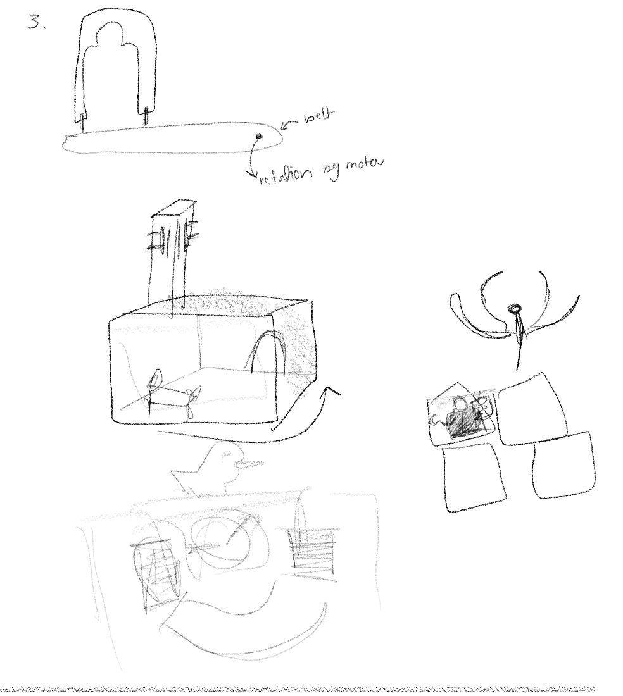
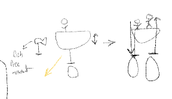

### To be added in documentation
* details about myths

# idea
I wanted to explore Emarati/Arabic myths. 

## Background
There are a few creatures from myths from this region that me and my friends talked about in school when I was younger, but I didn't know their orgins or the acual way they were described when their stories used to be circulated. Some of the myths I found were used to deter children to from stuff that. For example one myth about a creature called "Hemarat elgayla" (roughly translates to The Donkey of Noon Time) was used to scare children from playing outside when around noon time because the sun was hottest at that time. Another example is "Bu Daryah" (roughly translates Man of the sea) which is a myth likely created to scare kids and youth from going to sea at night.

I picked a few of the ones that were associated with a time of day:

الحمارة القايلة noon

أم السعف والليف night

بابا درياه/بودرياه before sunrise

# design process
### idea 1
I was not sure how to incoperate all 3 myths in my project so I sketched out a few ideas. One was to create 3 seperate 2d automata (inspired by wolfcatworkshop.com's automata) and then bringing each "scene" up after each other(like the image below labeled "idea 1 img"). but this would require me to handle all the wires connected to the motors and wasn't ideal in general.

  

  

<figure ">
  
  <figcaption > idea 1 img </figcaption>
</figure>

### idea 2
Another idea was to set all the myths in side a room in a traditional house. So the myth's creatures would peek into the window or through the door. Initially one of the myth was one that took place in the house but I decided not to inlcude that one, and all the other myths take place outside so it became pointless to set the myths inside a house.

  

  

### idea 3
One idea was to create 2D automata and place them on the walls of the box. or maybe as a comic strip. I didn't continue with those ideas though.

  

### idea 4
I liked how the myths looked beside each other so I decided to find a way to place them beside each other in a cohesive way and setteled on this.

  

The house is where the "Hemarat Algayla" myth would take place around noon, the palms is where the myth of "Um Alsaaf w el leaf" would be, and finall the water is where "bu darya" myth would take place. I also added a sun and a moon to indicate the time the myth is taking place in. I was talking to people and someone mentioned hvaing a disk with a night and morning sky instead of just having a moon and sun on a wire around the main middle part.
this is how I generally wanted it to look like and then I started working out the details.

##### Hemarat Algayla

  

this is how part is from the side.

  

##### Um Alsaaf w el leaf

  

I might use something like this to make the child and "Um Alsaaf w el leaf" run

  

##### bu darya

  

  

#### motion needed
I noted down the type of motion needed for each part.

  

  

  

  

  

  

  

# building
The one that seemed most complicated to me was the "bu darya" myth. all my sketches remained vague becuase I wasn't sure how to implement it so I decided to start with that one.

## bu darya
for this one I wanted to create a boat scene with 3 people in the boat. The myth creature would rise up for a few seconds and go down, but one of the people in the ship would also go down. This would be repeated until all people in the ship are gone then it would repeate
### cams
I started by creating the cams, I looked at many cams to see what kind of shape would work for me and then started desgining one(I took some advise from my dad on how to build them and he expained that I could mark the points on the cam I want things to happen and match the ups and downs on each cam to those if this makes sense. I also traced some cams and altered them.
The first cam is for "bu Darya" where it would rise and go down 3 times, the second is for the first person to go down, and he would stay down until all of the go down and so on. (the blue part is the cam.

  

I cut the peices out of carbaord, but after so much trial and error I realized that a. the friction is too much. I tried to fix this by sticking smooth tape on top of the cam and that improved the movement a bit. but then there is the second probleme b. the cam shape that produces the best movement doesn't have a deep enough drop

  

  

  

  

  

  

  

### circular motion to linear motion
I decided to use the mechanism we prevoiusly used to turn circular motion to linear motion. This protoype could be improved by reducing the friction and adjusting the place and length of the first shaft.

  

  

  

  

  

  

  

## aesthetic inspiration

  

  

  

  

  

  

  

  

  

  

